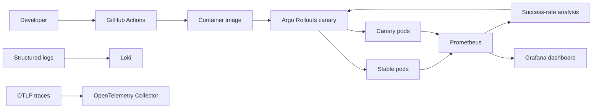

# Release Sentinel DevOps Lab

Production-style DevOps/SRE showcase for safe releases, observability, and automated rollback.

The lab ships a small Go service with controlled failure injection, a hardened container image, Kubernetes and Helm manifests, Prometheus/Grafana observability, canary rollout analysis, load tests, and runbooks. The goal is to demonstrate how a release system can detect a bad version through live telemetry and stop it before it reaches all traffic.

## What this demonstrates

- reproducible local runtime for an HTTP service;
- Docker image built with a non-root runtime user;
- Kubernetes deployment with probes, security context, resource boundaries, and disruption controls;
- Helm chart with environment-specific values;
- Argo Rollouts canary strategy with Prometheus-backed analysis;
- Prometheus alerts, Grafana dashboard, and OpenTelemetry collector config;
- k6 smoke/load tests for release validation;
- CI pipeline with tests, image build, SBOM generation, and vulnerability scanning;
- operational runbooks for high error rate, latency spikes, and failed rollbacks.

## Architecture



## Quick start

```bash
make test
make run
```

The service listens on `http://127.0.0.1:8080`.

Useful endpoints:

- `GET /healthz` - liveness check;
- `GET /readyz` - readiness check;
- `GET /version` - build and runtime metadata;
- `GET /work` - synthetic business endpoint with optional latency/error injection;
- `GET /metrics` - Prometheus metrics.

## Local failure simulation

```bash
ERROR_RATE=0.35 LATENCY_MS=250 make run
```

This makes `/work` fail roughly 35% of the time and sleep for 250 ms. The same knobs are exposed as Kubernetes environment variables, which makes bad-release scenarios easy to reproduce.

## Repository layout

```text
apps/api/                 Go service used by the release lab
deploy/helm/              Helm chart for standard Kubernetes deployment
deploy/rollouts/          Argo Rollouts canary and analysis templates
observability/            Prometheus, Grafana, Loki, and OpenTelemetry config
tests/load/               k6 release validation scenarios
docs/runbooks/            Incident response runbooks
scripts/                  Local automation and validation scripts
```

## Demo path

1. Build and test the service.
2. Deploy the stable version with the Helm chart.
3. Deploy a canary version with elevated `ERROR_RATE`.
4. Let Prometheus observe the degraded success rate.
5. Watch Argo Rollouts abort the canary before full promotion.

The manifests are designed so the demo can run on any Kubernetes cluster with Prometheus and Argo Rollouts installed.
